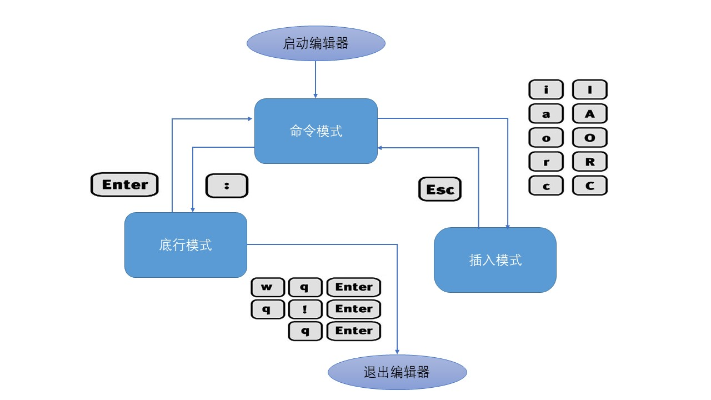

    

         
        
    

         
    

        
	

            
    Mini Editor 设计文档
     
     
    <table style="border:none;text-align:center;width:72%;font-family:仿宋;font-size:14px; margin: 0 auto;">
    <tbody style="font-family:方正公文仿宋;font-size:12pt;">
    	<tr style="font-weight:normal;"> 
    		<td style="width:20%;text-align:right;">题　　目</td>
    		<td style="width:2%">：</td> 
    		<td style="width:40%;font-weight:normal;border-bottom: 1px solid;text-align:center;font-family:华文仿宋"> Mini Editor 设计文档 </td>     </tr>
    	<tr style="font-weight:normal;"> 
    		<td style="width:20%;text-align:right;">授课教师</td>
    		<td style="width:2%">：</td> 
    		<td style="width:40%;font-weight:normal;border-bottom: 1px solid;text-align:center;font-family:华文仿宋"> 季江民 </td>     </tr>
    	<tr style="font-weight:normal;"> 
    		<td style="width:20%;text-align:right;">姓　　名</td>
    		<td style="width:2%">：</td> 
    		<td style="width:40%;font-weight:normal;border-bottom: 1px solid;text-align:center;font-family:华文仿宋"> 邱日宏</td>     </tr>
    	<tr style="font-weight:normal;"> 
    		<td style="width:20%;text-align:right;">学　　号</td>
    		<td style="width:2%">：</td> 
    		<td style="width:40%;font-weight:normal;border-bottom: 1px solid;text-align:center;font-family:华文仿宋">3200105842 </td>     </tr>
    	<tr style="font-weight:normal;"> 
    		<td style="width:20%;text-align:right;">日　　期</td>
    		<td style="width:2%">：</td> 
    		<td style="width:40%;font-weight:normal;border-bottom: 1px solid;text-align:center;font-family:华文仿宋">2022年 7月</td>     </tr>
    </tbody>              
    </table>

## 摘要

​		命令行编辑器作为在命令行对文本进行轻松便捷地编辑的工具，为人们的生活带来了很大的便利。Mini Editor作为一款命令行编辑器，能够帮助用户在命令行模式下启动文本编辑器对文本文档进行快速而有效的编辑。在有限状态机的模型架构和模型-视图-控制器模式下，Mini Editor可以根据当前所处的状态以及用户输入进行状态转移以实现丰富的功能。与其他命令行编辑器相比，Mini Editor具有程序精简，功能齐全，高效易用等特点，能够应用于众多文本查看与编辑的场景。

## 设计思想

​		在命令行编辑器的设计上，我们采用了**模型-视图-控制器（MVC）模式**进行设计。在MVC的模式架构下，用户所看到的图形界面的显示与所要显示内容的控制分由不同的模块来完成。即使用户是在编辑模式下进行文本编辑时，用户所输入的文本也不是直接传输到屏幕上进行显示的，而是先经过控制器（controller）对用户输入的合法性等进行判断，确认用户的输入为合法输入且属于文本编辑范畴，然后将用户的输入送给临时存储的文本文件模型（model）并对该临时文本进行修改，最后显示模块（view）对该临时文本进行读取，并按要求渲染到屏幕之上，形成了用户所看到的文本内容。这样通过分离模型、视图、控制器的设计方法让用户的操作控制和显示都变得更为简单和容易，同时也能够让用户在各类模型之间进行自由的切换，而不必担心输入的控制字符作为文本被显示在了屏幕之上。

​		在我们的Mini Editor命令行编辑器中，用户所看见的屏幕显示作为视图部分，是用户感受程序运行状态以及文本编辑情况的主要窗口。用户通过键盘的输入是用户对Mini Editor控制信号产生的来源，用户始终是以键盘向程序发送信号的方式实现各种交互功能的。我们的模型集中于程序运行过程中保存的一些变量以及一份临时拷贝的保存原文件编辑修改后内容的文件，控制器可以对其中的内容进行读取并以合理的方式将这些内容显示在终端屏幕之中。

​	MVC的设计思想构成了整个Mini Editor中坚不可摧的基石，是整个命令行编辑器设计的出发点与落脚点，是贯穿Mini Editor设计的灵魂所在。

## 有限状态机控制模型

​		为了实现一个命令行编辑器程序，**有限状态机**的模型对于其实现将是一个不错的选择。有限状态机（Finite-State Machine，FSM）是表示有限个状态以及在这些状态之间的转移和动作等行为的数学计算模型。

​		我们将命令行编辑器分为三种状态，分别是**命令模式**（command mode）、**插入模式**（Insert mode）和**底行模式**（last line mode）。各模式的功能简介及区分如下：

1) 命令模式（command mode）
    控制屏幕光标的移动，字符、字或行的删除，移动复制某区段及进入插入模式、底行模式。

2) 插入模式（Insert mode）
    用户只有在插入模式下才可以对文本进行编辑，按ESC键可回到命令模式。

3) 底行模式（last line mode）
    将文件保存或退出Mini Editor，如果未退出则回到命令模式。

​		关于有限状态机模型中各个模式更加详细的内容会在之后进行介绍，这里仅仅列出在Mini Editor设计过程中需要用到的三个模式以及它们内容的简介。下图中列出了Mini Editor的各个模式之间的关系以及它们之间相互转换的方法。

​		在编辑器里，如果我们能够将不同状态下编辑器所处的状态进行记录，并且在每一种状态下，用户可以采用不同的输入并发送相应的状态转移，那么，我们就可以实现编辑器中“命令模式”、“插入模式”、“底行模式”等多种不同模式之间的转移与变化。

​		有限状态机在shell脚本编程中的实现并不复杂，其实现的伪代码如下：

~~~shell
case $state in
	state1)
		case $operation in
			op1)
				...
				state=...
			op2)
				...
				state=...
			...
		...
	state2)
		case $operation in
			op3)
				...
				state=...
			op4)
				...
				state=...
			...
		...
	...
esac
~~~

## 独立视图显示模块

​		作为一款文本编辑软件，如果单纯仅仅只是将文本在用户原来的终端窗口显示所能够带来的表现力是远远不能够满足我们的需求的。如果采用不断刷新输出文档在用户原来的终端窗口显示的话，不仅会使得用户原本的终端窗口显示快速刷屏收到污染让用户难以再找到编辑文档之前的相关终端输出，而且也不利于打印文档编辑器中相关信息的控制。

​		因此，在我们所设计的编辑器中采用了**独立视图显示**的方法。在独立视图显示下，当用户运行Mini Editor程序之后，将进入一个新的终端屏幕显示Mini Editor的相关输出信息。在进入新窗口之前，为了保证用户在退出Mini Editor编辑器之后还能迅速恢复到原来的工作状态，继续进行下一步的工作，我们必须将用户原来屏幕的各种状态进行保存，然后再进入到新的屏幕之中。

​		为了能够实现屏幕上任意位置的输入控制，我们主要使用了Linux屏幕打印控制中的`tput`命令实现相关操作。通过定位屏幕位置打印各类文字和图标，我们可以将编辑器的各种状态信息以及用户所要编辑的文档等以一种较为好看的方式全区显示在屏幕之中，并且通过将不必要的内容清楚并重新打印信息来实现文本的更新。

## 临时文件编辑存储

​		在我们所设计的文本编辑器之中，采用了临时文件存储的方法，对用户所编辑的文档进行临时存储。当用户打开文本进行编辑的时候，我们的编辑器会在相应的目录下创建一个以_edit结尾的临时文件对用户所编辑更改的文本进行存储。

​		采用临时文本存储的方法，对用户所编辑的文档进行临时存储，有助于我们对于用户编辑过程存储文档、不保存文档直接退出等操作的实现。如果用户在退出编辑器的时候选择了保存并退出，那么用户所编辑的临时文件会覆盖掉原来的文件，实现保存的功能；如果用户在退出的时候选择了不保存直接退出，那么该临时文件将不会覆盖用户原本编辑的文件，用户原来的文档得以安全无恙的保存。

​		通过临时文件编辑存储的方法，可以在软件层面提高用户文档编辑的安全性。用户编辑过程中的任何操作都被记录在了编辑器所创建的这个临时文件之中。即使用户在编辑的过程中遇见了系统崩溃临时关机等突发情况，用户也可以通过编辑器所自动保存的临时文件找回之前所编辑的文档。

​		在用户退出编辑器之后，无论用户是否选择了保存文件，编辑器所创建的临时文件都会被删除。这样既可以在操作上实现对使用用户的隐藏，让用户能够无感知地体验到临时文件编辑存储所带来的功能，又能够保证用户文件夹的清洁和整齐，避免产生过多无用的临时文件。

## 基本操作

**用户界面介绍**

启动Mini Editor之后，您将进入Mini Editor的主界面。在界面上方显示的是打开的等待编辑或查看的文档文本。您可以在命令模式下控制光标在文本上的移动，或是在插入模式下对这些文本的内容进行编辑。在界面下方的最后一行会显示当前Mini Editor所处在的模式，Mini Editor中光标所在的行号与列号的信息，您可以通过这些信息辅助您判断当前Mini Editor所处在的状态。如果您在使用过程中有发生了一些错误或进行了一些Mini Editor预期之外的行为，则在界面下方还会显示出相应的错误信息提示您应进行正确的操作。

**a) 进入Mini Editor**

​		在系统提示符号输入minieditor.sh及文件名称后，就进入Mini Editor全屏幕编辑画面。例如下面这个例子：

~~~bash
$ ./minieditor.sh file
~~~

​		其中，\$为系统提示命令符，minieditor.sh的可执行程序位于当前目录下，file为您要编辑的文本文档的文件名称。如果minieditor.sh的可执行程序不在当前目录下的话，您需要改变该程序的引用目录，或将minieditor.sh文件所在路径添加到PATH的环境变量之中，才可以正常运行使用Mini Editor。

​		这里有一点需要特别注意，就是您进入Mini Editor之后，是处于命令行模式，您要切换到插入模式才能够输入文字。

**b) 切换至插入模式编辑文件**

​		在命令模式下按一下字母 i , I, a, A, o, O, r 或者 R，就可以进入插入模式，这时候您就可以以插入的方式开始输入文字了。这里的命令**不区分大小写**。其中，按 i 或者 I 切换进入插入模式后，是从光标当前位置开始输入文字；按 a 或者 A 进入插入模式后，是从光标所在位置的下一个位置开始输入文字；按 o 或者 O 进入插入模式后，是插入新的一行，从行首开始输入文字。相关内容整理如下表所示：

| 命令 | 解释                                   |
| ---- | -------------------------------------- |
| i    | 从光标当前位置开始以插入的方式输入文字 |
| a    | 从光标所在位置的下一个位置开始输入文字 |
| o    | 在文末插入新的一行并从行首开始输入文字 |

**c) 从插入模式切换至命令模式**
		处于插入模式时您只能输入文字，此时您输入的任何内容都会作为文本以插入的方式直接添加到文档之中。只有当您按下`ESC`键后，才可退出插入模式并转到命令模式。在插入模式下，您可以正常编辑文本，如果需要删除当前光标所在位置的内容，您可以通过按下退格键实现。

**d) 命令模式其他操作**
移动光标

​		在Mini Editor之中，您可以在命令模式下通过键盘按下英文字母 h 、 j 、 k 、 l ，分别控制光标左、下、上、右移一格，以此逐步将光标移动到您所需要的位置。

替换文本

​		命令模式里有一种特殊的文本编辑方式，通过替换的方法编辑内容。您可以通过按下r或者R后进入命令模式中的替换功能，此时Mini Editor会将您的输入替换光标所到之处的字符，直到按下 ESC 键为止才退出回到正常的命令模式。

**e) 退出Mini Editor及保存文件**

​		在命令行模式下，按一下冒号键进入底行模式。在底行模式下，你可以输入相应的命令完成相关操作。目前，Mini Editor支持的命令如下：

| 命令 | 解释                      |
| ---- | ------------------------- |
| :w   | 保存当前文件              |
| :wq  | 保存并退出Mini Editor     |
| :q   | 退出Mini Editor           |
| :q!  | 不存盘强制退出Mini Editor |
| :x   | 相当于 :wq 的功能         |

​		这里有一点需要注意的是，当您输入`:q`命令想要退出Mini Editor时，您应该确保您所有的编辑均已经进行了保存。否则Mini Editor会提示您“文件尚未保存，无法退出”。如果您在发生编辑后想要退出Mini Editor，您应该使用`:wq`或`:x`命令保存最新的编辑成果并退出，或者使用 `:q!`不保存文档强制退出编辑器。

**f) 错误提示**

​		为了让我们的提示信息等更加丰富且便于用户阅读，我为我的命令行编辑器的提示信息添加了丰富多彩的颜色。事实上，在shell中，屏幕输出文本的颜色是可以使用打印的一些不可见字符来控制的，我们可以使用 ANSI 颜色编码来指定输出的颜色。

​		例如，这里列出了一些常见的颜色编码：30 (黑色), 31 (红色), 32 (绿色), 33 (黄色), 34 (蓝色), 35 (洋红), 36 (青色), 37 (白色)。通过这些颜色编码与合理的控制，我们就可以让我们的输出产生丰富多彩的颜色。